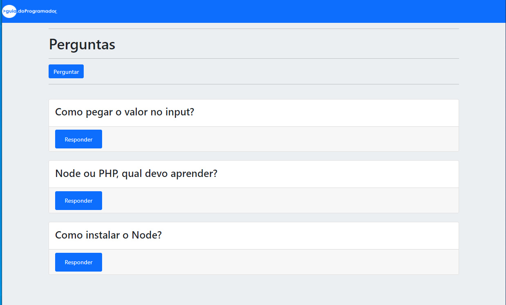
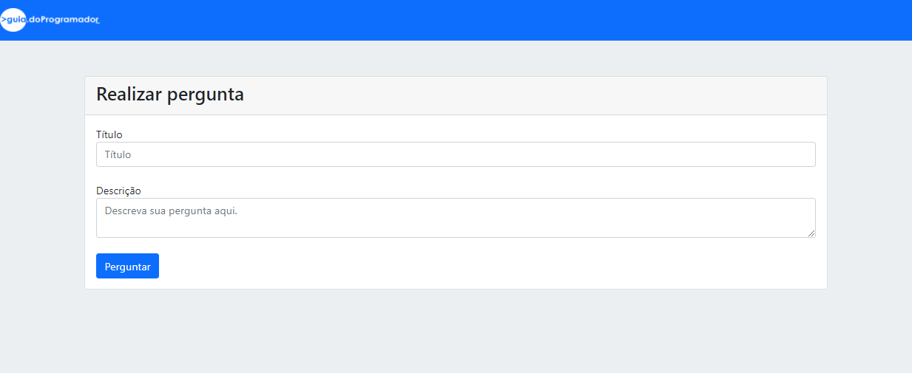
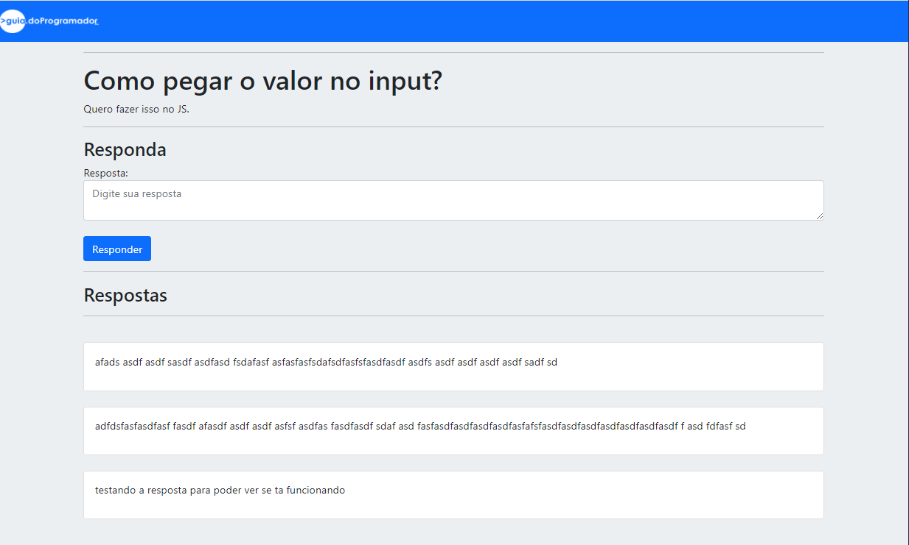

<p align="center">
  <a href="#-projeto">Projeto</a>&nbsp;&nbsp;&nbsp;|&nbsp;&nbsp;&nbsp; 
  <a href="#-como-rodar">Como rodar</a>&nbsp;&nbsp;&nbsp;|&nbsp;&nbsp;&nbsp;
  <a href="#-como-contribuir">Como contribuir</a>&nbsp;&nbsp;&nbsp;
</p>

<br>

# Guia de peruntas e respostas

## 🚀 Tecnologias

Esse projeto foi desenvolvido com as seguintes tecnologias:

- [Yarn](https://yarnpkg.com/) - 1.22.4
- [Npm](https://www.npmjs.com/) - 6.14.5
- [NodeJS](https://nodejs.org/en/) - v14.4.0
- [CSS3](https://developer.mozilla.org/pt-BR/docs/Web/CSS)
- [HTML5](https://developer.mozilla.org/pt-BR/docs/Web/HTML/HTML5)
- [JavaScript](https://developer.mozilla.org/pt-BR/docs/Web/JavaScript)
- [Bootstrap 4](https://getbootstrap.com/)
- [Postgres](https://www.postgresql.org/)
- [Docker](https://www.docker.com/) - 19.03.8

## 💻 Projeto

Projeto de um guia de perguntas e respostas.

Projeto do curso [Formação Node.js](https://www.udemy.com/course/formacao-nodejs/learn/lecture/16529728#overview).

<p align="center">
  
</p>

<p align="center">
  
</p>

<p align="center">
  
</p>

## 🚀 Como Rodar

- Clone o projeto.
- npm install.
- Rodar o Postgres com docker: 
```
docker run --name gostack_postgres -e POSTGRES_PASSWORD=docker -p 5432:5432 -d postgres
```
- Criar um banco com o nome guiaperguntas.
- 'nodemon index.js' para iniciar o projeto.
- acesse http://localhost:3000/

## 🤔 Como contribuir

- Faça um fork desse repositório;
- Cria uma branch com a sua feature: `git checkout -b minha-feature`;
- Faça commit das suas alterações: `git commit -m 'feat: Minha nova feature'`;
- Faça push para a sua branch: `git push origin minha-feature`.

Depois que o merge da sua pull request for feito, você pode deletar a sua branch.

